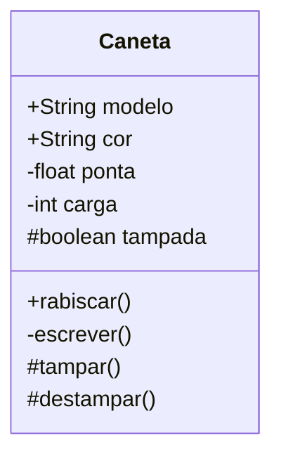

> ⚠️ **Aviso:** Este conteúdo foi gerado com ajuda de Inteligência Artificial (IA) e pode conter erros ou imprecisões.  
> Sempre verifique a informação antes de utilizar.

---

🎥 [Vídeo no Spotify](https://open.spotify.com/episode/5lxtq434WXBluRk7Foj3v6DecDPbeKo0gbhK4Lyk8zZ2) — gerado por IA com resumos do conteudo.  
Útil para uma revisão rápida dos temas tratados na disciplina.

<iframe src="https://open.spotify.com/embed/episode/1bTNsDPaYrrKaHNv6oC5qj" width="100%" height="152" frameborder="0" allowtransparency="true" allow="encrypted-media"></iframe>

## 1. Visibilidade e Modificadores de Acesso

A visibilidade, em POO, "indica o nível de acesso aos componentes internos de uma classe". Ela define quem pode acessar os atributos e métodos de uma classe. Os principais modificadores de visibilidade são:

- **Público (+):** "A classe atual e todas as outras classes" podem acessar o componente. Componentes públicos são a interface da classe com o mundo exterior.
- **Privado (-):** Apenas "somente a classe atual" pode acessar o componente. Atributos privados são a forma principal de proteger os dados internos.
- **Protegido (#):** Permite acesso a "classes no mesmo pacote e subclasses".
- **Sem modificador (default ou package-private):** Apenas "classes no mesmo pacote" podem acessar.

### Exemplo (Classe Caneta com sinais de visibilidade UML):



**Explicação:**

- `modelo` e `cor` são públicos, acessíveis por qualquer outra classe.
- `ponta` e `carga` são privados, acessíveis apenas dentro da classe Caneta.
- `tampada` é protegida, acessível pela Caneta, classes no mesmo pacote e subclasses.

---

## 2. Encapsulamento

O encapsulamento é um dos pilares da POO e "consiste em ocultar os detalhes internos de uma classe, expondo para os demais objetos somente os dados e métodos necessários por meio de interfaces públicas." As "interfaces públicas" são os "dados ou métodos que podem ser acessados/chamados por outros objetos", definindo "o que ele é capaz de fazer sem revelar como faz."

### Benefícios do Encapsulamento:

- **Controle de Acesso:** "Permite que a classe controle como as variáveis de instância são acessadas ou modificadas, garantindo, por exemplo, que valores inválidos não sejam atribuídos."
- **Flexibilidade e Manutenção:** "A implementação da classe pode ser alterada sem impactar as classes que a utilizam, desde que os métodos getters e setters sejam mantidos."
- **Segurança de Dados:** "Protege a integridade dos dados, impedindo que sejam expostos ou alterados de forma inadequada."

---

## 3. Métodos Inicializadores (Construtores)

"Além de métodos e atributos, a definição de uma classe pode incluir também inicializadores (construtores, apesar de não construírem nada!) que são operações usadas para inicializar os atributos dos objetos."

### Características dos Construtores:

- **Mesmo Nome da Classe:** "Inicializadores têm o mesmo nome da classe."
- **Sobrecarga:** "Podem haver mais de um, desde que com número e/ou tipos de argumentos diferentes." Isso permite criar objetos de diferentes maneiras.

### Exemplo:

```java
class Caneta {
    public String modelo;
    public String cor;

    // Construtor com dois parâmetros
    Caneta(String modelo, String cor) {
        this.modelo = modelo;
        this.cor = cor;
    }

    // Construtor com um parâmetro (sobrecarga)
    Caneta(String modelo) {
        this.modelo = modelo;
    }
}

class Main {
    public static void main(String[] args) {
        Caneta c1 = new Caneta("M1", "Azul"); // Usando o primeiro construtor
        Caneta c2 = new Caneta("M2");         // Usando o segundo construtor
    }
}
```

---

## 4. Getters e Setters

Getters e Setters são métodos que "permitem o acesso indireto a atributos privados de uma classe." Eles são uma "manifestação prática do princípio de encapsulamento," oferecendo "uma maneira segura e controlada de acessar os dados de um objeto."

### Princípio Fundamental:

"Em um contexto ideal, todos os atributos de uma classe são mantidos privados para protegê-los de acessos e modificações não autorizadas. Para acessar ou modificar esses atributos, são utilizados métodos públicos conhecidos como getters e setters."

---

### 4.1. Getters (Acessores)

**Propósito:** "Permitem a leitura dos valores dos atributos. Eles não modificam os dados, apenas retornam seus valores."

**Convenção de Nomenclatura:** Prefixo `get` seguido pelo nome do atributo com a primeira letra maiúscula.

```java
class Caneta {
    private String modelo;
    private String cor;

    public String getModelo() {
        return modelo;
    }

    public String getCor() {
        return cor;
    }
}
```

---

### 4.2. Setters (Modificadores)

**Propósito:** "São usados para modificar os valores dos atributos. Prefixo `set` seguido pelo nome do atributo com a primeira letra maiúscula."

```java
class Caneta {
    private String modelo;
    private String cor;

    public void setModelo(String modelo) {
        this.modelo = modelo;
    }

    public void setCor(String cor) {
        this.cor = cor;
    }
}
```

---

### 4.3. Melhores Práticas com Getters e Setters:

- **Validação de Dados:** "No setter, sempre valide os dados antes de atribuí-los aos atributos."
- **Nominação Consistente:** "Utilize convenções de nomenclatura consistentes."
- **Minimizar o Uso de Setters para Atributos Imutáveis:** "Para atributos que não devem ser alterados após a criação do objeto, é recomendável não implementar setters. Em vez disso, os valores podem ser definidos uma única vez através do construtor."

---

Em suma, a combinação de **visibilidade controlada**, **encapsulamento**, **construtores para inicialização** e o **uso estratégico de getters e setters** promove uma "arquitetura de software robusta, flexível e fácil de manter."
